# Report
> Project #1. Scanner 2020  
> 
> 2018000337  
> 장호우

## Environment
* Ubuntu 20.04.1 LTS
* flex 2.6.4
* gcc version 9.3.0

## Part I. Implementation of C-Scanner using C-code
In `globals.h`

```c
#define MAXRESERVED 12

typedef enum 
    /* book-keeping tokens */
   {ENDFILE,ERROR,
    /* reserved words */
    IF,ELSE,WHILE,RETURN,INT,VOID,THEN,END,REPEAT,UNTIL,READ,WRITE,
    /* multicharacter tokens */
    ID,NUM,
    /* special symbols */
    ASSIGN,EQ,NE,LT,LE,GT,GE,PLUS,MINUS,TIMES,OVER,LPAREN,RPAREN,LBRACE,RBRACE,LCURLY,RCURLY,SEMI,COMMA
   } TokenType;
```

To define what will be used in actual codes. The keywords reserved words, symbols and other necessary tokens are added to TokenType numbers.

In `scan.c`

```c
typedef enum
{
  START,
  INEQ,
  INCOMMENT,
  INNUM,
  INID,
  DONE,
  INLT,
  INGT,
  INNE,
  INOVER,
  INCOMMENT_
} StateType;
```
To make state types are also mapped to StateType.

```c
static struct {
  char *str;
  TokenType tok;
} 
reservedWords[MAXRESERVED] = {
  {"if", IF},           {"else", ELSE},     {"while", WHILE},   {"return", RETURN}, 
  {"int", INT},         {"void", VOID},     {"then", THEN},     {"end", END}, 
  {"repeat", REPEAT},   {"until", UNTIL},   {"read", READ},     {"write", WRITE}
};
```
When compiler finished scanning and gets tokens, to check if the token is reserved word.

From line 111 to line 298 of the file as following:
```c
  while (state != DONE)
  {
    int c = getNextChar();
    save = TRUE;
    switch (state)
    {
    case START:

	  ...

    case INOVER:
      save = FALSE;
      if (c == '*')
      {
        state = INCOMMENT;
        tokenStringIndex--;
      }
      else
      {
        state = DONE;
        ungetNextChar();
        currentToken = OVER;
      }
      break;
    case INCOMMENT:
      save = FALSE;
      if (c == EOF)
      {
        state = DONE;
        currentToken = ENDFILE;
      }
      else if (c == '*')
        state = INCOMMENT_;
      break;
    case INCOMMENT_:
      save = FALSE;
      if (c == EOF)
      {
        state = DONE;
        currentToken = ENDFILE;
      }
      else if (c == '*')
        state = INCOMMENT_;
      else if (c == '/')
        state = START;
      else
        state = INCOMMENT;
      break;

	  ...

    if (state == DONE)
    {
      tokenString[tokenStringIndex] = '\0';
      if (currentToken == ID)
        currentToken = reservedLookup(tokenString);
    }
  }
```

The compiler tokenizing given input string streams, keeps calling `getNextChar()` until it meets `DONE` state. But the comments have total three states as following `INOVER`, `INCOMMENT`, `INCOMMENT_`. `INOVER` is state where compiler found '/'. This state figures out if '/' is used for `OVER` or beginning of comment '/*'. If compiler finds '\*' after '/', the state changes to `INCOMMENT` state. `INCOMMENT` state is when tokenizer is inside the comment string. it is looking for '\*'. It is part of end comment, '\*/'. when compiler found '\*' in `INCOMMENT` state, state changes to `INCOMMENT_` state. `INCOMMENT_` state is now looking for '/' character to end the comment. if it finds other characters, it goes back to `INCOMMENT` state or stays in `INCOMMENT_` state when the character is '\*'.


In `util.c`
```c
    case ASSIGN: fprintf(listing,"=\n"); break;
    case EQ: fprintf(listing,"==\n"); break;
    case NE: fprintf(listing,"!=\n"); break;
    case LT: fprintf(listing,"<\n"); break;
    case LE: fprintf(listing, "<=\n"); break;
    case GT: fprintf(listing, ">\n"); break;
    case GE: fprintf(listing,">=\n"); break;
    case LPAREN: fprintf(listing,"(\n"); break;
    case RPAREN: fprintf(listing,")\n"); break;
    case LBRACE: fprintf(listing,"[\n"); break;
    case RBRACE: fprintf(listing,"]\n"); break;
    case LCURLY: fprintf(listing,"{\n"); break;
    case RCURLY: fprintf(listing,"}\n"); break;
    case COMMA: fprintf(listing,",\n"); break;
    case SEMI: fprintf(listing,";\n"); break;
    case PLUS: fprintf(listing,"+\n"); break;
    case MINUS: fprintf(listing,"-\n"); break;
    case TIMES: fprintf(listing,"*\n"); break;
    case OVER: fprintf(listing,"/\n"); break;
    case ENDFILE: fprintf(listing,"EOF\n"); break;
```
To print tokens.

## Part II. Implementation of C-Scanner using lex(flex) by Tiny.lmodification

To use flex instead of scan.c and other files are same as before, such as globals.h, main.c util.c.

In `cminus.l`

```l
"/*"		    { char c, tmp=NULL;
					do{
							c = input();
							if(c==EOF) break;
							if(c=='\n') lineno++;
							if(tmp=='*'&&c=='/' ) break;
							tmp = c;
					}while(c);
				}
.				{ return ERROR;}
```

## Example and Result Screenshot
Example: **test.1.txt**
```c
/* A program to perform Euclid's
   Algorithm to computer gcd */

int gcd (int u, int v)
{
	if (v == 0) return u;
	else return gcd(v,u-u/v*v);
	/* u-u/v*v == u mod v */
}

void main(void)
{
	int x; int y;
	x = input(); y = input();
	output(gcd(x,y));
}

```
Result Screenshot:

1. For `./scanner_cimpl`
	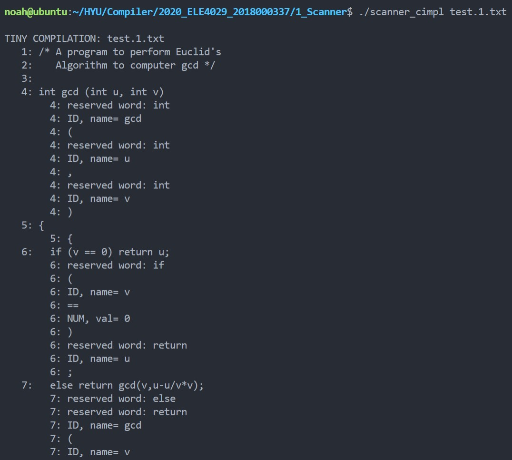
	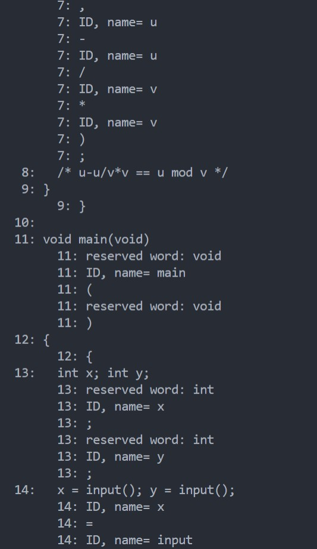
	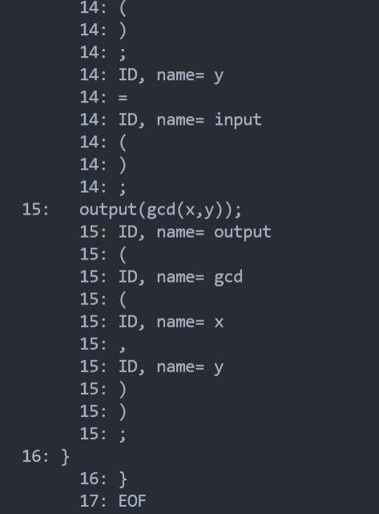

2. For `./scanner_flex`
	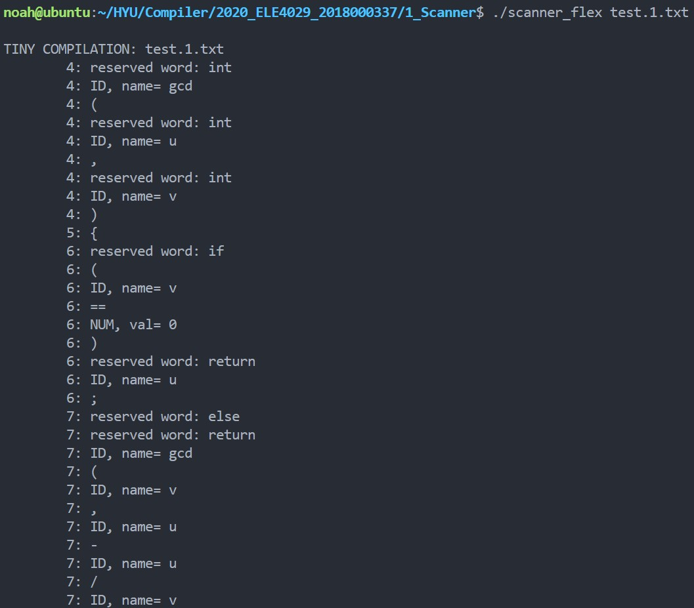
	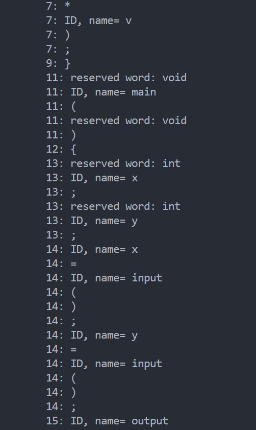
	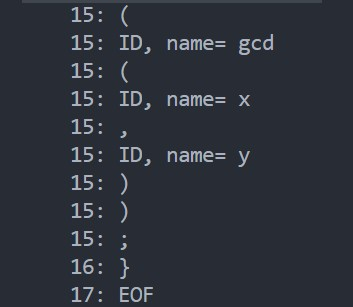

Example: **test.2.txt**
```c
void main(void)
{
	int i; int x[5];
	
	i = 0;
	while( i < 5 )
	{
		x[i] = input();

		i = i + 1;
	}

	i = 0;
	while( i <= 4 )
	{
		if( x[i] != 0 )
		{
			output(x[i]);
		}
	}
}

```
Result Screenshot:

2. For `./scanner_cimpl`
	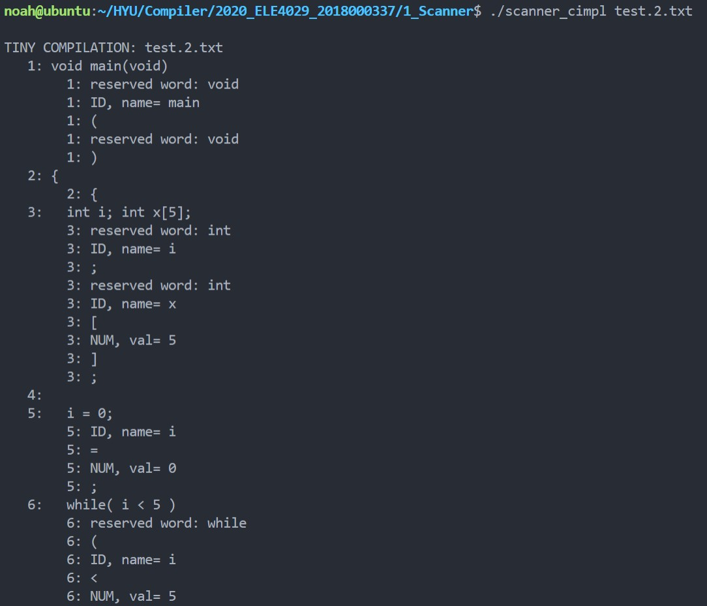
	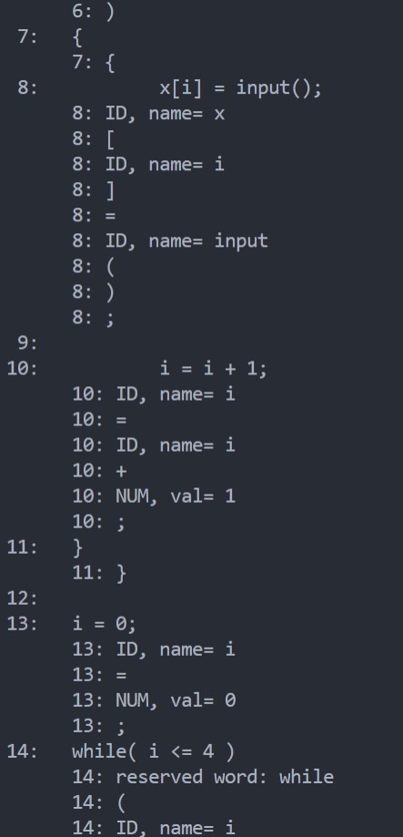
	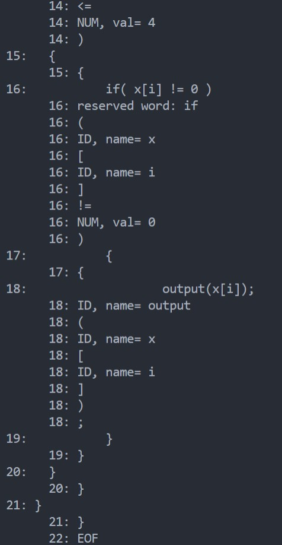

2. For `./scanner_flex`
	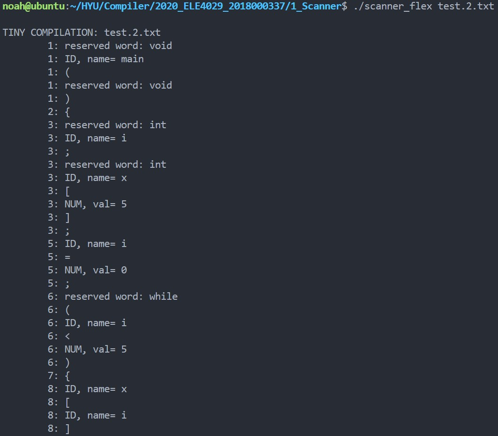
	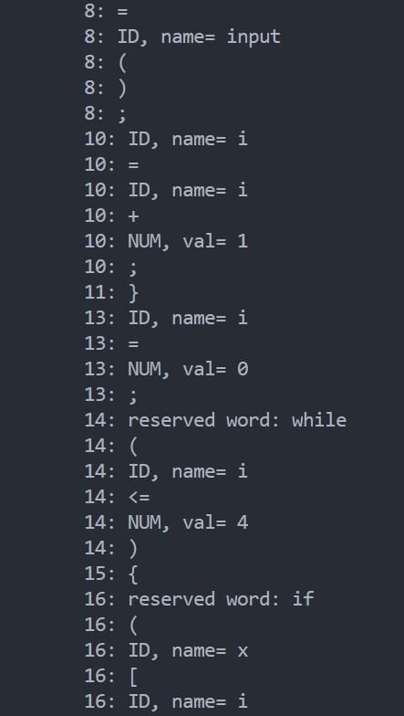
	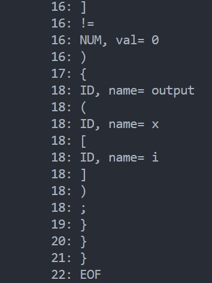
