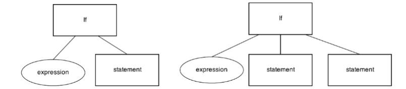

# Report
> Project #2. Parser 2020  
> C-Minus Parser Implementation
> 
> 2018000337  
> 장호우

## Environment
* Ubuntu 20.04.1 LTS
* flex 2.6.4
* gcc version 9.3.0

## Implement the parser using Yacc
### globals.h
```c++
typedef enum {StmtK, ExpK, DecK} NodeKind;
typedef enum {VarK, FunK, ParamK} DecKind;
typedef enum {CompK, IfK, WhileK, RetK} StmtKind;
typedef enum {OpK, ConstK, IdK, ArrIdK, CallK} ExpKind;
typedef enum {Void, Integer, Array} ExpType;
```
Define StmtK, ExpK, and DecK as the node type. Each type has several types.


DecKind contains Var, Function and Parameter types. Arrays will have additional information, which is size.





StmtKind contains Compound, While statement, If statement and Return statement.


ExpKind contains Operation, Constant, Call, Id and array Id.

Define the tree structure as following.
```c++
typedef struct treeNode
   { struct treeNode * child[MAXCHILDREN];
     struct treeNode * sibling;
     int lineno;

     NodeKind nodekind;
     union {
        StmtKind stmt;
        ExpKind exp;
        DecKind dec;
    } kind;
    
     union {
        TokenType op;
        int val;
        char* name;
    } attr;
    int size;
    ExpType type;
   } TreeNode;
```

### util.c
```c++
TreeNode * newDecNode(DecKind kind)
{ TreeNode * t = (TreeNode *) malloc(sizeof(TreeNode));
  int i;
  if (t==NULL)
    fprintf(listing,"Out of memory error at line %d\n",lineno);
  else {
    for (i=0;i<MAXCHILDREN;i++) t->child[i] = NULL;
    t->sibling = NULL;
    t->nodekind = DecK;
    t->kind.dec = kind;
    t->lineno = lineno;
  }
  return t;
}
```
Creating and initializing new kinds of node which define in `globals.h` file.

```c++
void printTree( TreeNode * tree )
{ int i;
  INDENT;
  while (tree != NULL) {
    printSpaces();
    if (tree->nodekind==StmtK) ...
    else if (tree->nodekind==ExpK) ...
    else if (tree->nodekind==DecK) ...
    else fprintf(listing,"Unknown node kind\n");
    for (i=0;i<MAXCHILDREN;i++)
         printTree(tree->child[i]);
    tree = tree->sibling;
  }
  UNINDENT;
}
```
To print a syntax tree via their type.

### cminus.y
Implementation of specific rules that BNF Grammar.
From line 66~86, in the case of ID and NUM, when token string is the last token string of each token, it should be splitted.

## Example and Result Screenshot
Example: **test.1.cm**
```c++
/* A program to perform Euclid's 
   Algorithm to computer gcd */

int gcd (int u, int v)
{
    if (v == 0) return u;
    else return gcd(v,u-u/v*v);
    /* u-u/v*v == u mod v */
}

void main (void)
{
    int x; int y;
    x = input(); y = input();
    output(gcd(x,y));
}
```

Example: **test.2.cm**
```c++
/* Semantic Error Example */
/* (1) uninitialized variables a and b (2) undefined variable c */
int main ( void )
{
    int a;
    int b;
    c = a + b;
}
```

Example: **test.3.cm**
```c++
/* dangling else example */
void main(void) { if(a<0) if (a>3) a=3; else a=4; }
```

### Result Screenshot:

For test.1.cm


For test.2.cm


For test.3.cm

