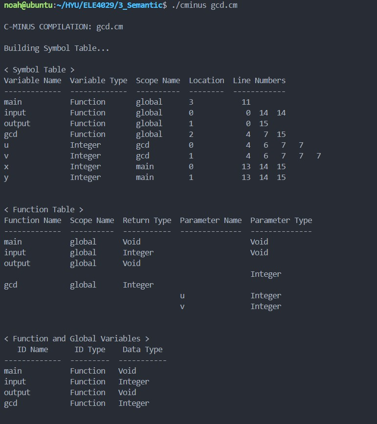
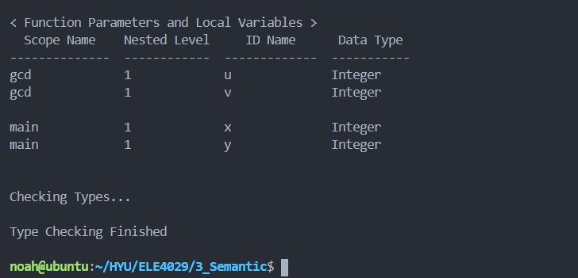
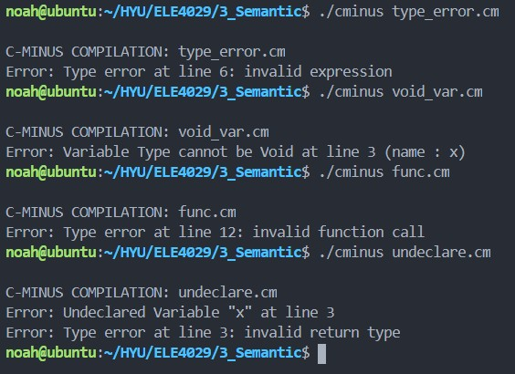

# Report

> Project #3. Semantic 2020  
> C-Minus Semantic AnalysisSymbol Table & Type Checker
>
> 2018000337  
> 장호우

## Environment

* Ubuntu 16.04.7 LTS
* bison (GNU Bison) 3.0.4
* flex 2.6.0
* gcc version 5.4.0

## Implementation

### main.c

```c++
#define NO_ANALYZE FALSE
int EchoSource = FALSE;
int TraceScan = FALSE;
int TraceParse = FALSE;
int TraceAnalyze = TRUE;
int TraceCode = FALSE;
```

Set the TraceAnalyze flag as TRUE to Semantic Analysis.

```c++
#if !NO_ANALYZE
  if (!Error)
  {
    buildSymtab(syntaxTree);
    typeCheck(syntaxTree);
    if (TraceAnalyze && !Error)
    {
      fprintf(listing, "\nBuilding Symbol Table...\n");
      printSymTab(listing);
      fprintf(listing, "\nChecking Types...\n");
      fprintf(listing, "\nType Checking Finished\n\n");
    }
  }
```

When error occurs, Symbol Table will be not print, print out all errors only.

### symtab.h

```c++
typedef struct LineListRec
{
  int lineno;
  struct LineListRec *next;
} * LineList;

typedef struct BucketListRec
{
  char *name;
  TreeNode *treeNode;
  LineList lines;
  int memloc;
  struct BucketListRec *next;
} * BucketList;

typedef struct ScopeListRec
{
  char *funcName;
  BucketList hashTable[SIZE];
  struct ScopeListRec *parent;
  int nestedLevel;
} * ScopeList;

```

Create a BucketList structure to store nodes and a ScopeList structure to wrap it while traversing the Syntax Tree.

```c++
void st_insert(char *name, int lineno, int loc, TreeNode *treeNode);
int st_lookup(char *name);
void st_add_lineno(char *name, int lineno);
int st_lookup_top(char *name);

BucketList get_bucket(char *name);
ScopeList sc_create(char *funcName);
ScopeList sc_top(void);
void sc_pop(void);
void sc_push(ScopeList scope);
int addLocation(void);
```

Implement Static Scope, add functions that manage Scope as Stack.

```c++
void printSymTab(FILE *listing);
void print_SymTab(FILE *listing);
void print_FuncTab(FILE *listing);
void print_Func_globVar(FILE *listing);
void print_FuncP_N_LoclVar(FILE *listing);
```

To print functions or symbol table.

### analyze.c

```c++
static void typeError(TreeNode * t, char * message);
static void symbolError(TreeNode * t, char * message);
static void undeclaredError(TreeNode * t);
static void redefinedError(TreeNode * t);
static void funcDeclNotGlobal(TreeNode * t);
static void voidVarError(TreeNode * t, char * name);
static void insertIOFuncNode(void);
static void afterInsertNode(TreeNode * t);
static void beforeCheckNode(TreeNode * t);
```

Compound State is added in the insertNode function, a new scope is created and pushed to the stack. And when exiting the Compound State through the afterInsertNode function, the Stack is popped.

When a new declaration, check the HashTable of the current scope to see if there are any duplicates. Also, when using a variable, search from the top of the current Scope Stack to check if the variable exists.

### globals.h

```c++
typedef struct treeNode
{
  struct treeNode *child[MAXCHILDREN];
  struct treeNode *sibling;
  int lineno;
  NodeKind nodekind;
  union
  {
    StmtKind stmt;
    ExpKind exp;
    DeclKind decl;
    ParamKind param;
    TypeKind type;
  } kind;
  union
  {
    TokenType op;
    TokenType type;
    int val;
    char *name;
    ArrayAttr arr;
    struct Scope *scope;
  } attr;
  ExpType type;
} TreeNode;
```

## Example and Result Screenshot

Example: **gcd.cm**

```c++
/* A program to perform Euclid's 
  Algorithm to computer gcd */

int gcd(int u, int v)
{ 
    if (v == 0) return u; 
    else return gcd(v,u-u/v*v); 
    /* u-u/v*v == u mod v */ 
} 

void main(void) 
{ 
    int x; int y; 
    x = input(); y = input(); 
    output(gcd(x,y)); 
}
```

**Result Screenshot**



Example: **type_error.cm**

```c++
int main(void)
{
	int x;
	int y[3];
	
	x + y;

	return 0;
}
```

Example: **void_var.cm**

```c++
int main(void)
{
	void x;
	return 0;
}
```

Example: **func.cm**

```c++
int x(int y)
{
	return y + 1;
}

int main(void)
{
	int a;
	int b;
	int c;

	return x( a, b, c );
}
```

Example: **undeclare.cm**

```c++
void main(void)
{
	return x;
}
```

**Result Screenshot**

